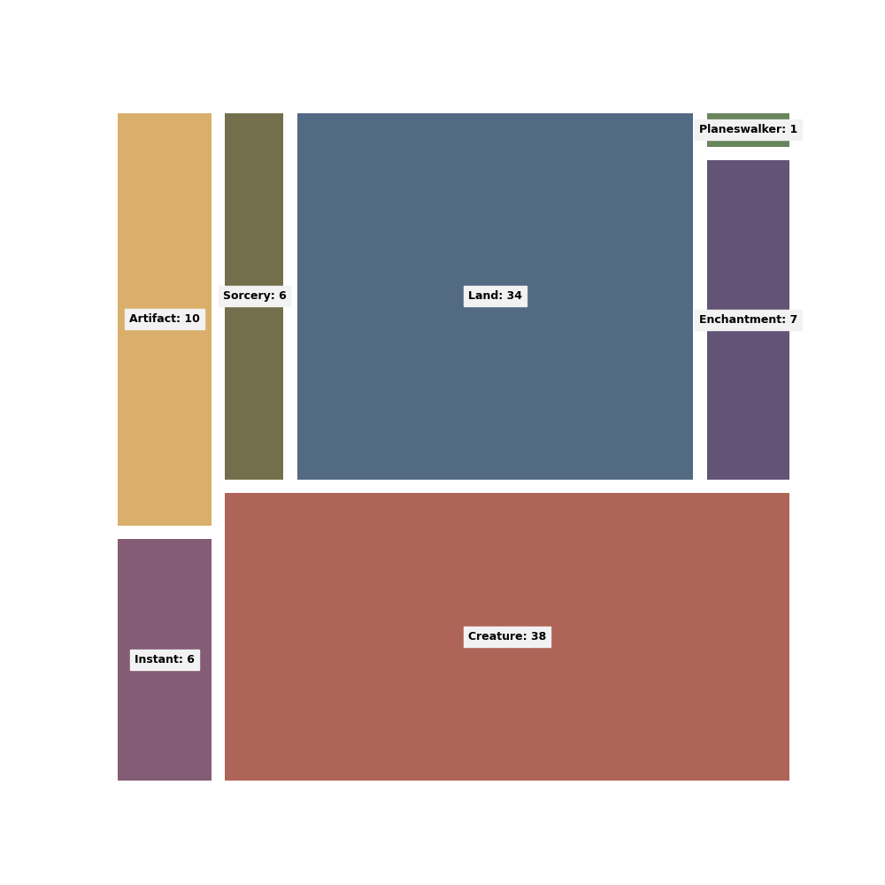
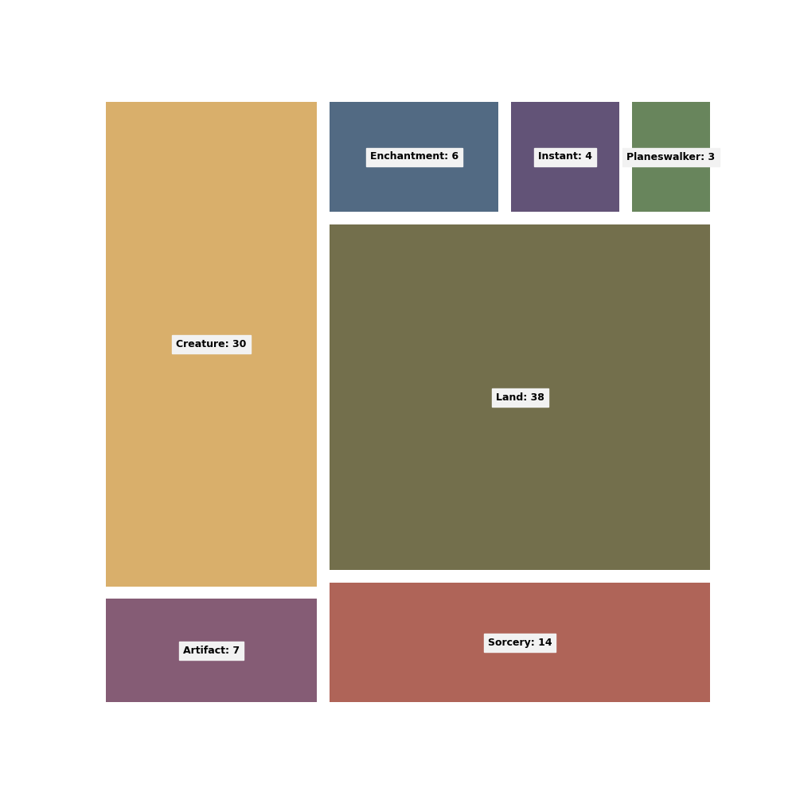
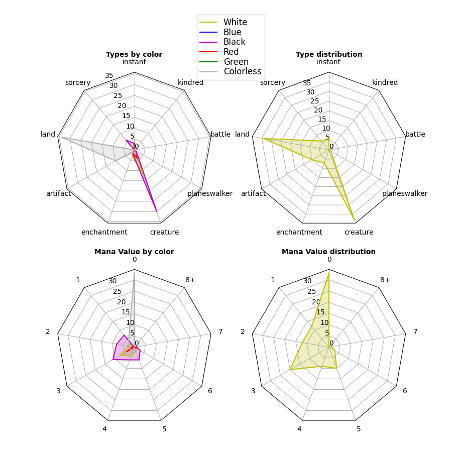
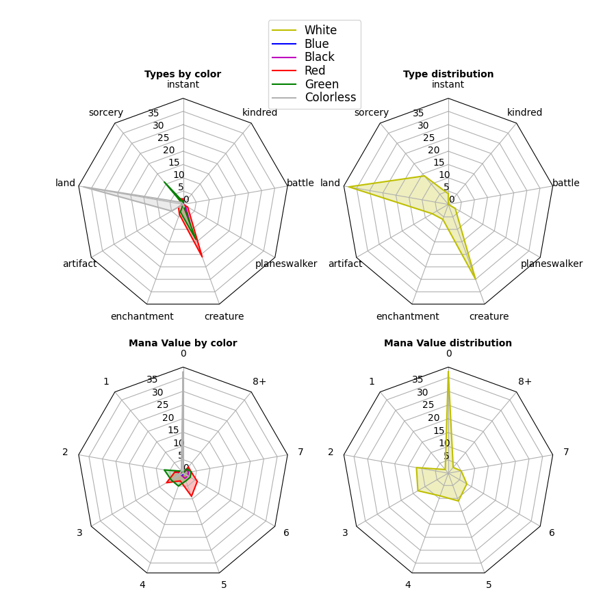
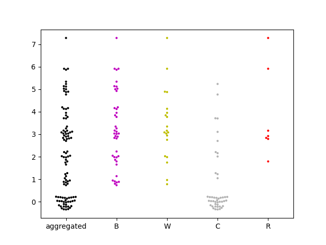
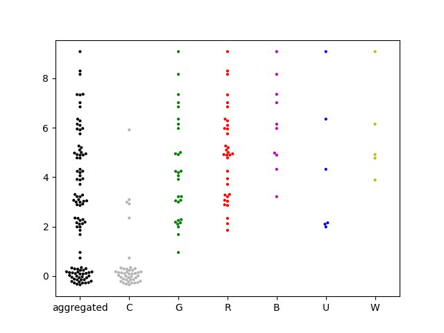

# PEC 2: Visualización de datos
Luis Victor Hevia Moreno
## Datos empleados en los ejemplos

Para todos los ejemplos, se basan en análisis de la distribución de distintas características de un mazo
cualquiera de Magic: The Gathering, partiendo de una lista de cartas en formato JSON, con la información obtenida
para dichas cartas a través de la api de [Scryfall](https://scryfall.com/docs/api).

## Técnica grupo 1: Treemap

### Definición

El treemap es una técnica de visualización de datos jerarquizados que consiste en representar la información en
mediante rectángulos anidados, donde cada uno representa una categoría y su tamaño es proporcional a su valor,
de forma que es posible comparar visualmente cada categoría e incluso ver más fácilmente la suma de conjuntos.

Diseñado originalmente por Ben Shneiderman, su intención era ,pstrar las estructuras de carpetas en un sistema de
forma compacta.

### Datos

Se utiliza normalmente para mostrar tanto la relación jerárquica entre categorías de datos, así como la distribución
de los mismos de forma compacta y visual.
Por ello es necesario que los datos sean cuantitativos y jerárquicos, pero no se debería de usar con muchos niveles
de jerarquía dado que la visualización se vuelve confusa, en cuyo caso sería más apropiado un diagrama de árbol.

### Ejemplo

En este caso la visualización representa la distribucón de cartas por sus tipos, se podría extender a sus
super-tipos y sub-tipos, pero la representación era un poco confusa por la variabilidad de etiquetas. Por
tanto en este caso se emplea más en el sentido de visualizar rápidamente la relevancia por tipo de carta.

Este primer ejemplo muestra la distribución de cartas por tipo del mazo de ejemplo `edgar_deck.json`.

Podemos ver que sus tipos más relevantes son las criaturas y las tierras, seguido por artefactos y encantamientos.

En este segundo ejemplo se muestra la distribución de cartas por tipo del mazo de ejemplo `ur_dragon.json`.

En este caso, las tierras y criaturas son los tipos más relevantes, pero a con una mayor presencia de conjuros.

## Técnica grupo 2: Radar Chart

### Definición

El radar chart o gráfico de araña, es una visualizaciṕn bidimensional que se utiliza para mostrar datos de una o
más series con respecto a multiples variables cuantitativas. Cada variable tiene su propio eje equidistante y todos
los ejes se unen en el centro, formando una figura similar a una telaraña. Los valores por cada variable se representan
mediante un punto en el eje correspondiente, para despúes unir esos puntos correspondientes formando un polígono.

### Datos

Los datos adecuados para este tipo de visualización son aquellos con multiples variables cuantitativas con una o más
categorías a representar por polígono. Hay que tener en cuenta que aunque es bastante util para
ver las distribuciones por variable, puede llegar a ser complicado ver más de un par de categorías
debido al solapamiento de polígonos.

### Ejemplo

En el primer ejemplo podemos ver 4 visualizaciones, dos correspondientes a la distribución de cartas por tipo y dos
a la distribucón de costes de maná de las cartas del mazo `edgar_deck.json`. Además, el segundo caso de cada uno tiene
esas distribuciones con múltiples categorías representadas por los colores a los que pertenecen.

Podemos ver que la distribución de tipos concuerda con la anterior vista en el treemap, pero con el detalle del color
se puede apreciar una desviación hacia el negro bastante clara (además del incoloro por las tierras). Además podemos
ver que la mayoría de sus costes (sin contar tierras), ronda entre los costes 1 y 3.

En el segundo ejemplo, vemos la misma representación del mazo `ur_dragon.json`

En este caso podemos ver que los colores predominantes son el verde y el rojo, y que gran parte de los costes se
encuentran entre el 2, 3 y 5.

## Técnica grupo 3: Beeswarm
### Definición

El beeswarm se trata de una visualización bidimensional donde se representa la distribución de valores a lo largo de
un único eje, pero que los valores se separan en el eje perpendicular para ser capaces de distinguir todos los puntos
sin que se produzca solapamiento.

### Datos

Su principal uso es el de encontrar tendencias en conjuntos de datos de una sóla dimensión, aunque se pueden
representar jerarquías o más categorías separando las nubes de puntos o utilizando colores distintos.

### Ejemplo

De nuevo vamos a visualizar la distribución por coste de maná, de forma que podamos distinguir mejor su distribución.
Para una mejor representación de los valores dado que originalmente se tratan de enteros, les he añadido un poco de
variación en el eje Y, pero se puede seguir viendo la distribución de los valores porque no se alejan demasiado.
Adicionalmente, volveré a mostrar la distribución conjunta, así como la división por colores.

Podemos confirmar la distribución de los costes entre 1 y 3, y que la mayoría de las cartas son negras.

En el segundo ejemplo, vemos la misma representación del mazo `ur_dragon.json`

En este caso podemos ver que los colores predominantes son el verde y el rojo, y que sus costes se reparten
entre 2, 3 y 5, además que se distingue mejor los valores más sólitarios como es el único coste de 8+.
